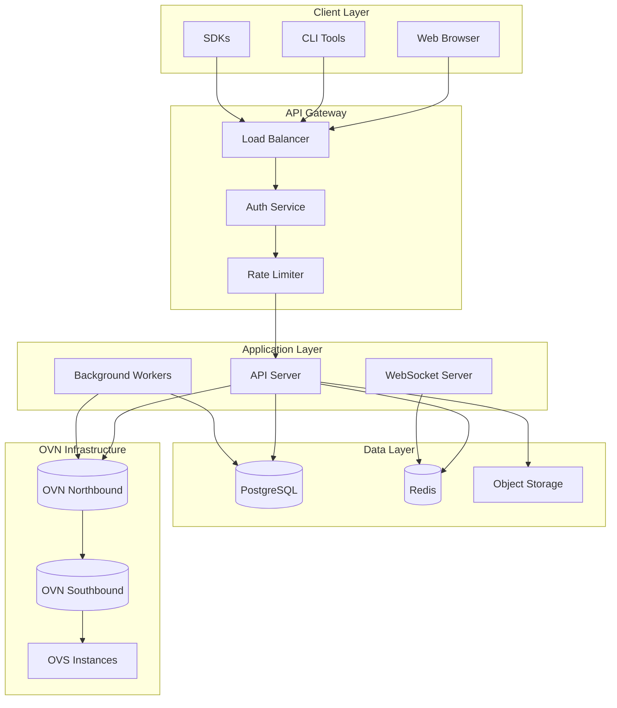
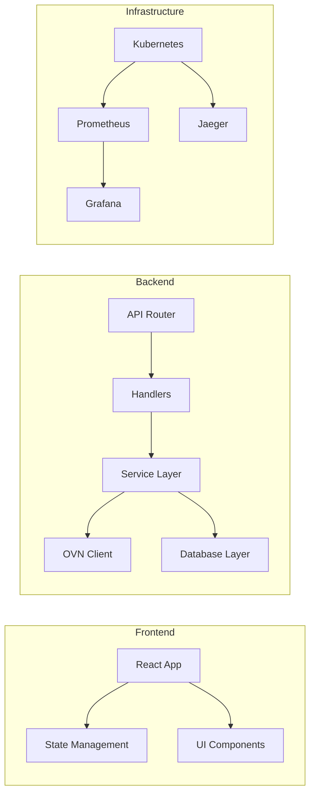
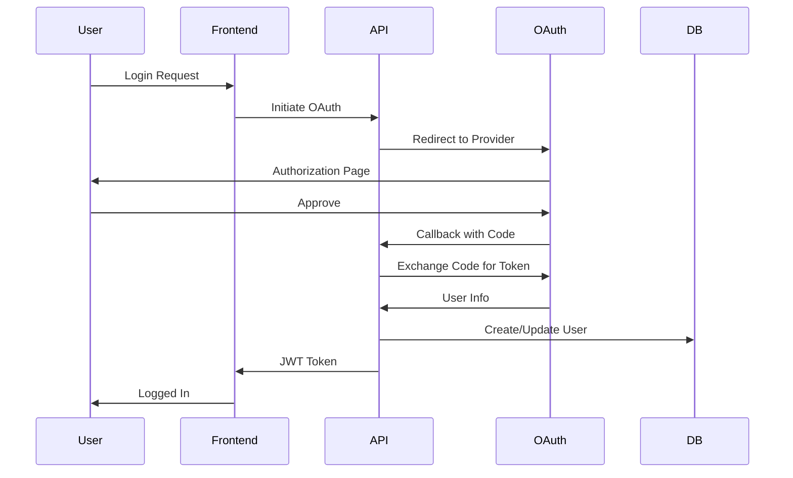
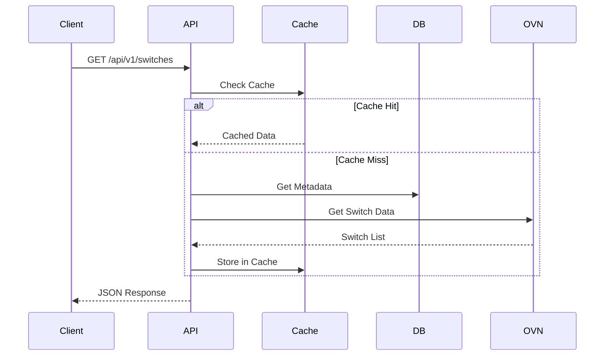
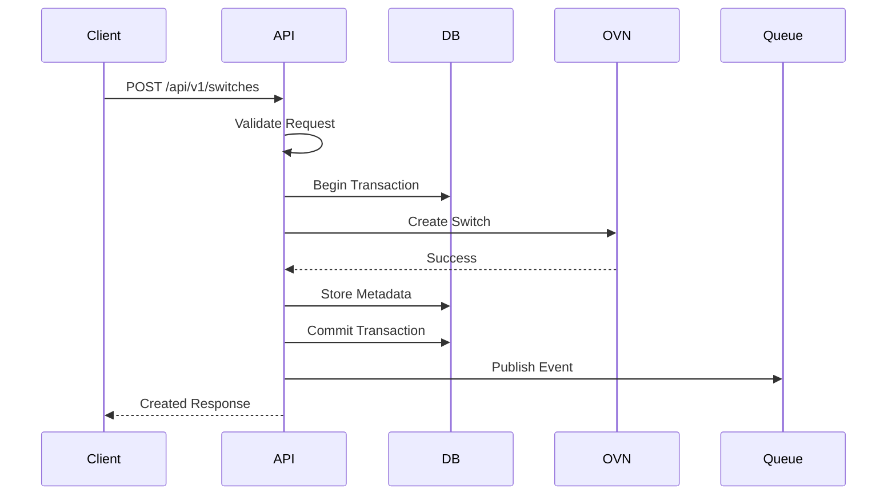
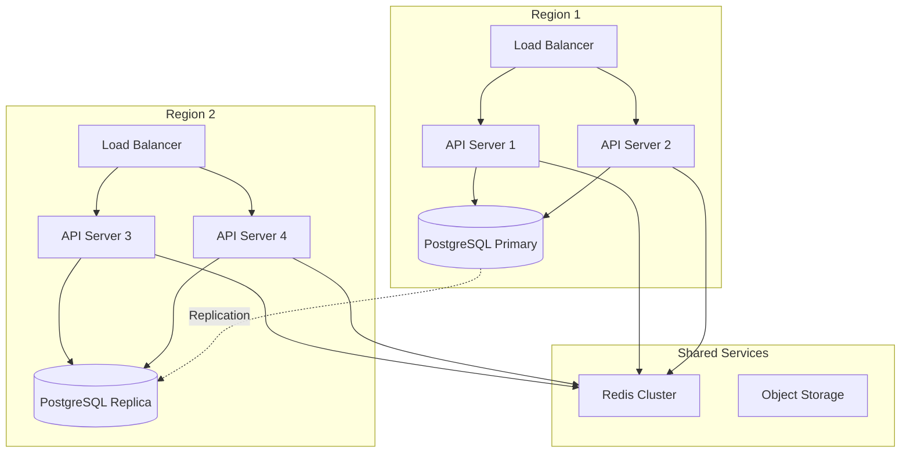
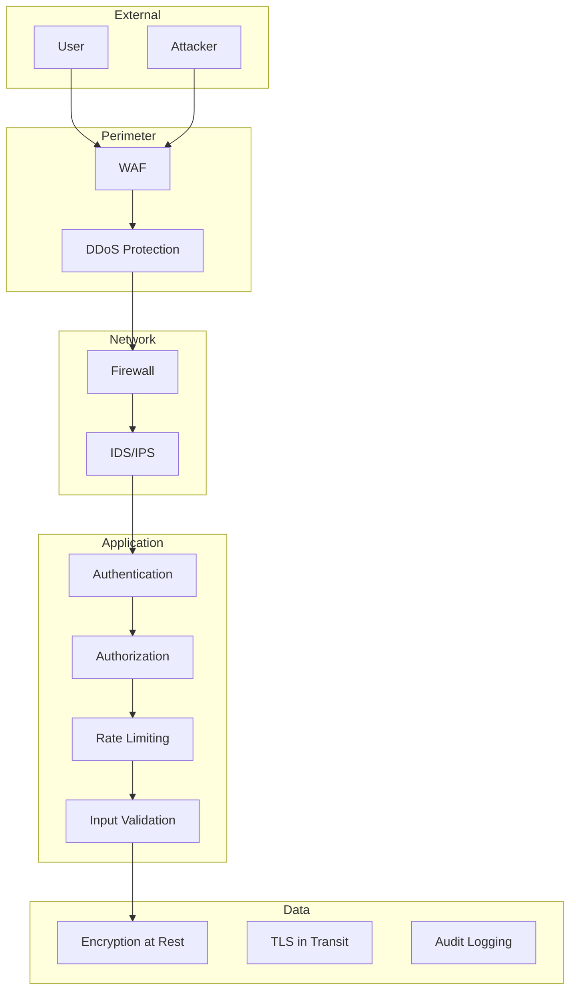
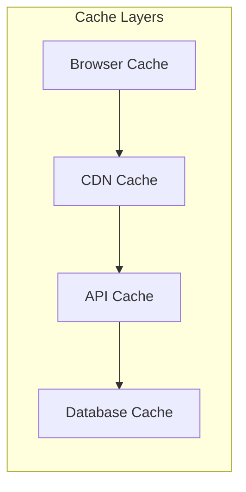
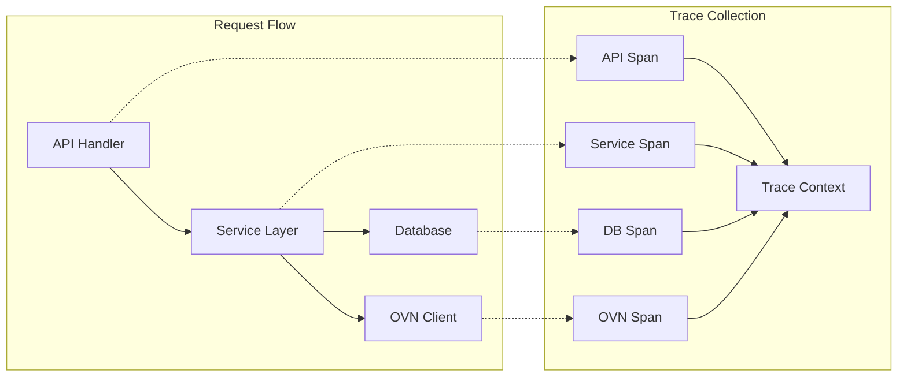

# OVN Control Platform Architecture

## Overview

OVN Control Platform (OVNCP) is a cloud-native application designed to provide a comprehensive management interface for Open Virtual Network (OVN) infrastructure. The platform follows microservices architecture principles while maintaining simplicity and operational efficiency.

## System Architecture

### High-Level Architecture



### Component Architecture



## Core Components

### API Server

The API server is the heart of OVNCP, providing RESTful endpoints for all operations.

**Responsibilities:**
- Request routing and handling
- Authentication and authorization
- Input validation and sanitization
- Business logic orchestration
- Response formatting

**Technology Stack:**
- Language: Go 1.22+
- Framework: Gin Web Framework
- Database: PostgreSQL with GORM
- Caching: Redis
- Metrics: Prometheus

**Key Design Decisions:**
- Stateless design for horizontal scaling
- Context-based request handling
- Middleware-based architecture
- Interface-driven development

### Web Frontend

Modern React-based SPA providing intuitive user interface.

**Responsibilities:**
- User interface rendering
- State management
- Real-time updates
- Data visualization
- Client-side routing

**Technology Stack:**
- Framework: React 18+
- Language: TypeScript
- State: Zustand/Redux Toolkit
- UI: Shadcn/ui + Tailwind CSS
- Build: Vite
- Testing: Vitest + React Testing Library

### OVN Client Library

Custom Go library for interacting with OVN databases.

**Features:**
- Connection pooling
- Automatic retry with backoff
- Transaction support
- Event streaming
- Type-safe operations

**Architecture:**
```go
type Client interface {
    // Connection management
    Connect(ctx context.Context) error
    Close() error
    
    // Logical Switch operations
    CreateLogicalSwitch(ctx context.Context, ls *LogicalSwitch) error
    GetLogicalSwitch(ctx context.Context, id string) (*LogicalSwitch, error)
    UpdateLogicalSwitch(ctx context.Context, ls *LogicalSwitch) error
    DeleteLogicalSwitch(ctx context.Context, id string) error
    ListLogicalSwitches(ctx context.Context, opts ListOptions) ([]*LogicalSwitch, error)
    
    // Transaction support
    Transaction(ctx context.Context, ops []Operation) error
    
    // Event streaming
    Watch(ctx context.Context, table string) (<-chan Event, error)
}
```

### Authentication & Authorization

Multi-provider authentication system with fine-grained authorization.

**Authentication Flow:**


**Authorization Model:**
- Role-Based Access Control (RBAC)
- Resource-level permissions
- Dynamic permission evaluation
- Audit logging

### Database Design

PostgreSQL schema optimized for performance and scalability.

**Core Tables:**
```sql
-- Users and authentication
CREATE TABLE users (
    id UUID PRIMARY KEY DEFAULT gen_random_uuid(),
    email VARCHAR(255) UNIQUE NOT NULL,
    name VARCHAR(255),
    provider VARCHAR(50),
    provider_id VARCHAR(255),
    created_at TIMESTAMP DEFAULT NOW(),
    updated_at TIMESTAMP DEFAULT NOW()
);

-- Roles and permissions
CREATE TABLE roles (
    id UUID PRIMARY KEY DEFAULT gen_random_uuid(),
    name VARCHAR(50) UNIQUE NOT NULL,
    description TEXT,
    permissions JSONB
);

-- Resource tracking
CREATE TABLE resources (
    id UUID PRIMARY KEY DEFAULT gen_random_uuid(),
    type VARCHAR(50) NOT NULL,
    ovn_uuid VARCHAR(36) UNIQUE,
    name VARCHAR(255),
    metadata JSONB,
    owner_id UUID REFERENCES users(id),
    created_at TIMESTAMP DEFAULT NOW(),
    updated_at TIMESTAMP DEFAULT NOW()
);

-- Audit logs
CREATE TABLE audit_logs (
    id UUID PRIMARY KEY DEFAULT gen_random_uuid(),
    user_id UUID REFERENCES users(id),
    action VARCHAR(50),
    resource_type VARCHAR(50),
    resource_id UUID,
    details JSONB,
    ip_address INET,
    created_at TIMESTAMP DEFAULT NOW()
);
```

## Data Flow

### Read Operations



### Write Operations



## Deployment Architecture

### Kubernetes Deployment

```yaml
apiVersion: apps/v1
kind: Deployment
metadata:
  name: ovncp-api
spec:
  replicas: 3
  strategy:
    type: RollingUpdate
    rollingUpdate:
      maxSurge: 1
      maxUnavailable: 0
  template:
    spec:
      containers:
      - name: api
        image: ovncp/api:latest
        resources:
          requests:
            memory: "256Mi"
            cpu: "250m"
          limits:
            memory: "512Mi"
            cpu: "500m"
        livenessProbe:
          httpGet:
            path: /health
            port: 8080
          initialDelaySeconds: 30
          periodSeconds: 10
        readinessProbe:
          httpGet:
            path: /ready
            port: 8080
          initialDelaySeconds: 5
          periodSeconds: 5
```

### High Availability Setup



## Security Architecture

### Defense in Depth



### Security Controls

1. **Authentication**
   - OAuth 2.0/OIDC providers
   - JWT tokens with short expiration
   - Refresh token rotation
   - MFA support

2. **Authorization**
   - Fine-grained RBAC
   - Resource-level permissions
   - Dynamic policy evaluation
   - Least privilege principle

3. **Data Protection**
   - TLS 1.2+ for all communications
   - AES-256 encryption at rest
   - Key rotation policies
   - Secrets management

4. **Application Security**
   - Input validation and sanitization
   - Output encoding
   - CSRF protection
   - Security headers (CSP, HSTS, etc.)

## Performance Considerations

### Caching Strategy



**Cache Policies:**
- Static assets: 1 year with cache busting
- API responses: 5-60 seconds based on endpoint
- Database queries: Query result caching
- OVN data: Event-based invalidation

### Optimization Techniques

1. **Database Optimization**
   - Connection pooling
   - Query optimization
   - Proper indexing
   - Partitioning for large tables

2. **API Optimization**
   - Response compression
   - Pagination
   - Field filtering
   - Batch operations

3. **Frontend Optimization**
   - Code splitting
   - Lazy loading
   - Virtual scrolling
   - Optimistic updates

## Monitoring and Observability

### Metrics Collection

```yaml
# Key metrics tracked
- API request rate and latency
- Error rates by endpoint
- Database query performance
- OVN operation latency
- Resource utilization
- Business metrics (resources created, etc.)
```

### Distributed Tracing



## Extensibility

### Plugin Architecture

```go
type Plugin interface {
    Name() string
    Version() string
    Init(config map[string]interface{}) error
    Start(ctx context.Context) error
    Stop(ctx context.Context) error
}

type ResourcePlugin interface {
    Plugin
    HandleCreate(ctx context.Context, resource Resource) error
    HandleUpdate(ctx context.Context, resource Resource) error
    HandleDelete(ctx context.Context, resourceID string) error
}
```

### Webhook System

```yaml
webhooks:
  - name: resource-created
    url: https://example.com/webhook
    events:
      - logical_switch.created
      - logical_router.created
    headers:
      Authorization: Bearer ${WEBHOOK_TOKEN}
    retry:
      attempts: 3
      backoff: exponential
```

## Future Considerations

### Planned Enhancements

1. **Multi-cluster Support**
   - Federated authentication
   - Cross-cluster networking
   - Global resource management

2. **Advanced Analytics**
   - Machine learning for anomaly detection
   - Predictive capacity planning
   - Cost optimization recommendations

3. **Enhanced Security**
   - Zero-trust architecture
   - Hardware security module integration
   - Advanced threat detection

4. **Performance Improvements**
   - GraphQL API support
   - Real-time streaming with gRPC
   - Edge caching with workers

## Conclusion

The OVN Control Platform architecture is designed to be:
- **Scalable**: Horizontal scaling for all components
- **Reliable**: High availability and fault tolerance
- **Secure**: Defense in depth with multiple security layers
- **Maintainable**: Clean architecture with clear boundaries
- **Extensible**: Plugin system and webhook support

This architecture enables OVNCP to handle enterprise-scale OVN deployments while maintaining simplicity and operational efficiency.